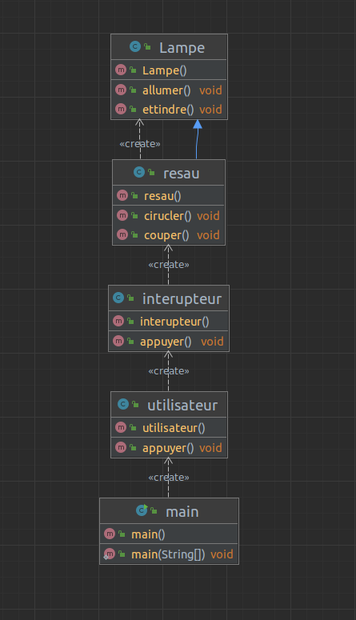
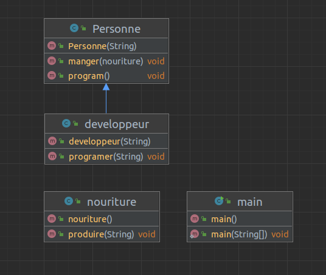
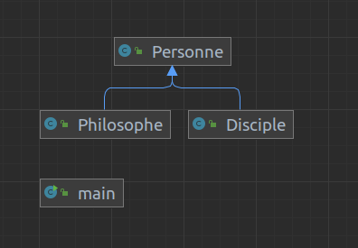

# tp devObj 1

---
Aujoudhuis le progrmae du tp et de voir comment cree un code java et un UML a partir d'une phrase

### Exercice 1

code de la classe utilisateur

```java
public class utilisateur {
    public void appuyer (){
        interupteur interupteur = new interupteur()
                interupteur.appuyer();
    }

}

```

code de la classe interupteur : 

``` java
public class interupteur {
    private boolean position = false;

    public interupteur (){
        this.position = false;
    }
    public void appuyer() {
        if (this.position = false) {
            this.position = true ;
            resau resau = new resau();
            resau.cirucler();
        }
        else {
            this.position = false ;
            resau resau = new resau();
            resau.couper();
        }

    }
}

```

code de la class resau

```java
public class resau extends Lampe {
    private boolean courant = false ;

    public void cirucler() {
        this.courant = true;
        Lampe lampe = new Lampe();
        lampe.allumer();
    }
    public void couper(){
        this.courant = false;
        Lampe lampe = new Lampe();
        lampe.ettindre();
    }


}

```

code de la calsse lampe :

```java
public class Lampe {
    private boolean power = false;

    public void allumer (){
        this.power = true;
    }

    public void ettindre(){
        this.power = false;
    }
}

```

code de la classe main :

```java
public class main {

    public static void main(String[] args) {
        utilisateur utilisateur = new utilisateur();
        utilisateur.appuyer();
    }
}
```

UML de la lampe :

Exercice 2 :
a)

main

```java
public class main {
    public static void main(String[] args) {
        developpeur jean = new developpeur("jean");
        nouriture n = new nouriture();
        jean.manger(n);
        n.produire("burger");
        jean.manger(n);
        System.out.println(jean.language);
    }
}
```

Personne :

```java
public class Personne {
    private String nom ="";

    public Personne(String nom){
        this.nom = nom;
    }

    public void manger(nouriture n){
        System.out.println(this.nom+" mange "+n.alliment);
    }
    public void program(){
        System.out.println(this.nom+" develloppe en "+ this);
    }
}
```

Developpeur

```java
public class developpeur extends Personne{
    public String language ="java";

    public developpeur(String nom) {
        super(nom);
    }
    public void programer(String langue){
        this.language = langue;
    }
}
```

Nouriture:

```java
public class nouriture {
    public String alliment ="pizza";

    public void produire(String alli){
        this.alliment = alli;
    }
}
```



b) code de la question 2
Philosophe :

```java
public class Philosophe extends  Personne{
    public String diciple;

    public Philosophe(String nom){
        super(nom);
    }

    public void disciple(String q){
        if (this.diciple.length() > 0)
        this.diciple = ", "+q;
        else {
            this.diciple = q;
        }
    }
}
```

Personne :

```java
public class Personne {
    public String nom ="";

    public Personne(String nom){
        this.nom = nom;
    }
}

```

Disciple :

```java
public class Disciple extends Personne{
        public String maitre ="";

    public Disciple(String n){
        super(n);
    }

    public void master(String m){
        this.maitre = m;
    }
}

```

main :

```java

public class main {
    public static void main(String[] args) {
        Disciple platon = new Disciple("platon");
        Philosophe socrate = new Philosophe("socrate");
        Disciple Xenophon = new Disciple("Xenophon");
        Disciple aristote = new Disciple("arisote");
        Disciple toto = new Disciple("toto");
        platon.master(socrate.nom);
        socrate.disciple(platon.nom);
        Xenophon.master(socrate.nom);
        socrate.disciple(Xenophon.nom);
        aristote.master(platon.nom);
        toto.master(platon.nom);
        System.out.println(platon.nom+" est un disicple de " platon.maitre + ","
                + Xenophon.nom + " est un diciple de " + Xenophon.maitre + ","
                + aristote.nom + " est un disicple de" + aristote.nom + ","
                + toto.nom + "est un diciple de " + toto.maitre);
    }
}

```



---

ce tp maura donc apris comment me servire de intelijie, els base de ce logielle, et comment passer de phrase simple a un uml et coder ce derniere.
